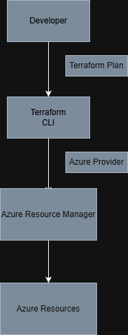

# Azure Infrastructure as Code with Terraform (Design-Only)

This project demonstrates the design of Azure infrastructure using Terraform. The goal is to showcase Infrastructure as Code (IaC) principles, modular design, and cost-aware cloud architecture without deploying resources.

---

## Objectives

- Define Azure infrastructure using declarative Terraform configuration
- Separate configuration from code using variables
- Demonstrate repeatable, environment-agnostic infrastructure design
- Avoid cloud costs by using plan-only workflows

---

## Technologies Used

- Terraform
- Microsoft Azure (azurerm provider)
- GitHub

---

## Designed Resources

- Azure Resource Group
- Azure Storage Account
- Azure Static Web App
- Linux Virtual Machine
- Network Security Group

---

## Architecture Overview

---

## Cost Considerations

All Terraform configurations were validated using `terraform init` and `terraform plan`. No resources were applied to avoid incurring charges.

